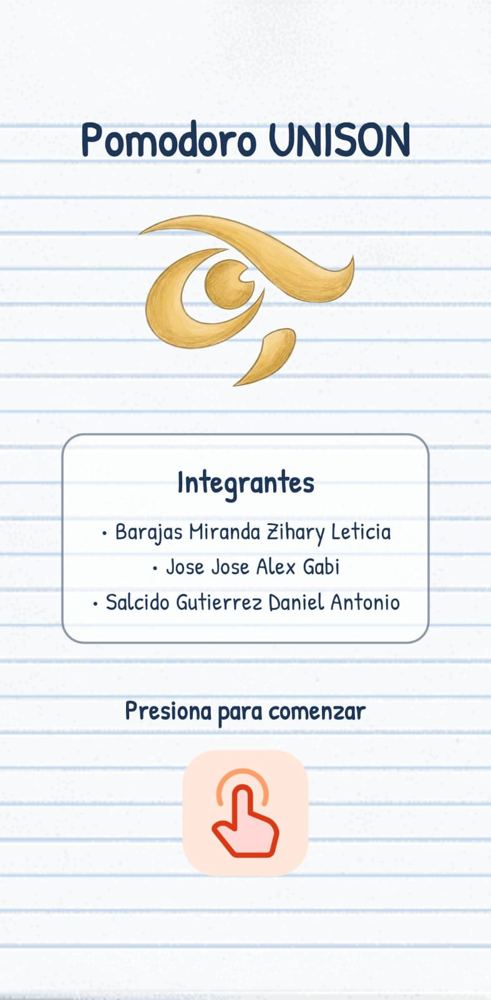
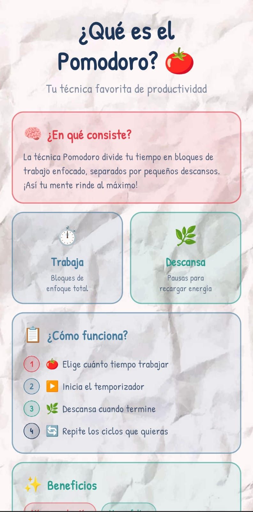
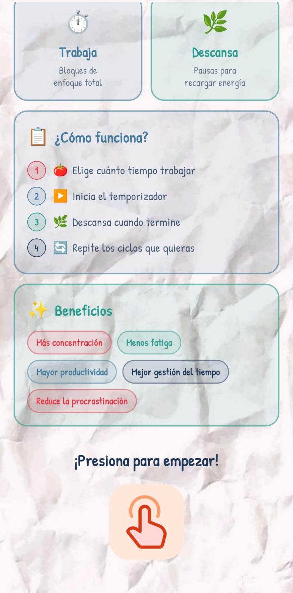
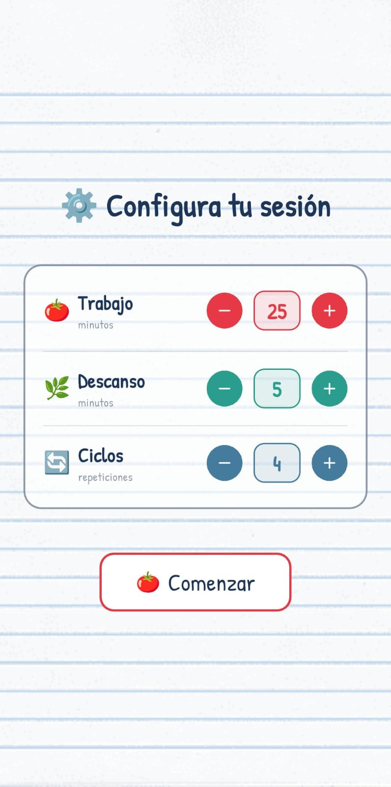
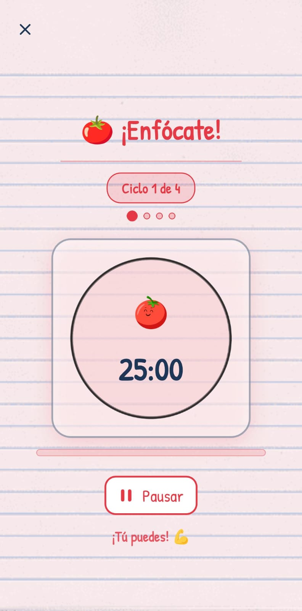
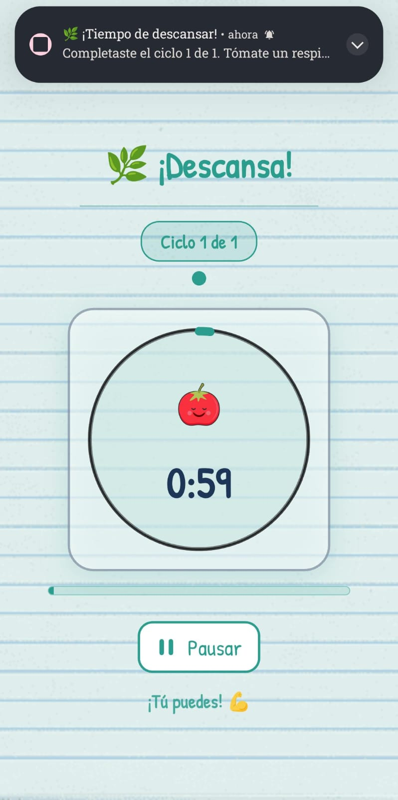
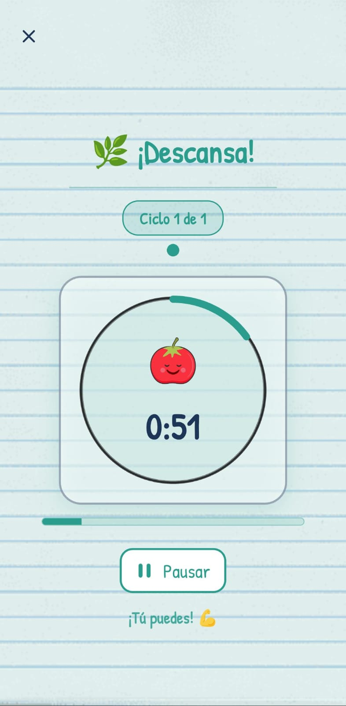
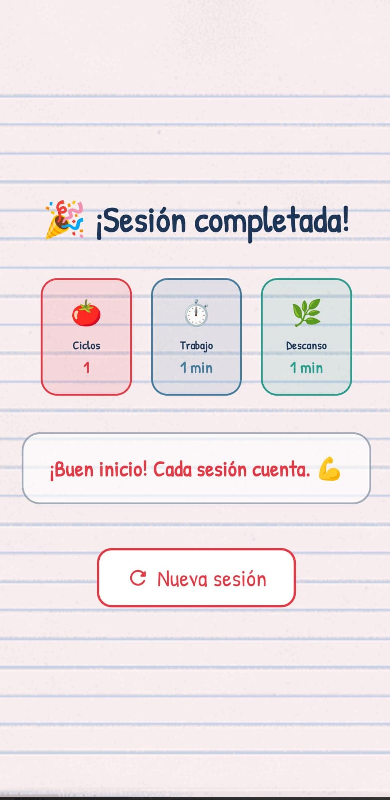
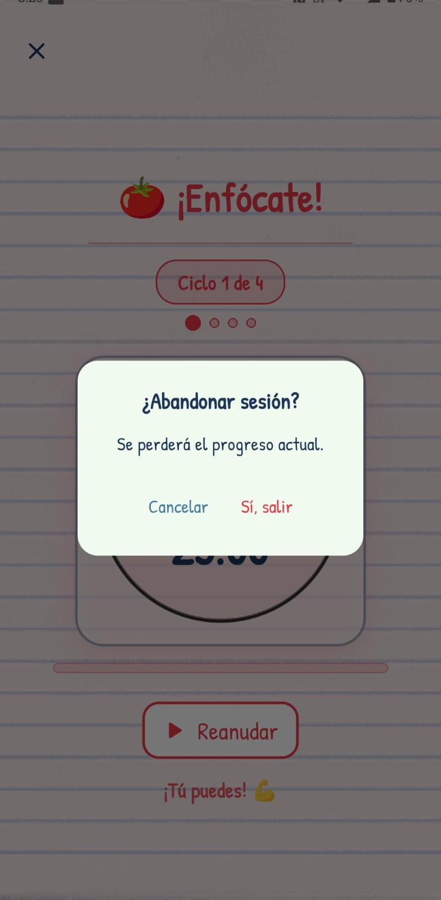

# 🍅 Pomodoro UNISON

Aplicación móvil de temporizador Pomodoro desarrollada por estudiantes de la Universidad de Sonora.

**Integrantes:**
- Barajas Miranda Zihary Leticia
- Jose Jose Alex Gabi
- Salcido Gutierrez Daniel Antonio

---
## 📖 Descripción

Pomodoro UNISON es una aplicación móvil desarrollada con Flutter como proyecto académico
en la Universidad de Sonora. Implementa la técnica Pomodoro, un método de gestión del
tiempo que divide el trabajo en bloques de concentración total separados por breves
descansos, ayudando a mejorar la productividad y reducir la fatiga mental.

La app permite configurar la duración del trabajo, los descansos y el número de ciclos,
notifica al usuario al terminar cada bloque y lleva un registro de la sesión completada.

## 📱 Pantallas

<table>
  <tr>
    <td align="center"> <b>Inicio</b> Pantalla de bienvenida con el logo de UNISON y los integrantes del equipo.</td>
    <td align="center"> <b>¿Qué es el Pomodoro?</b> Explica la técnica: bloques de trabajo enfocado separados por descansos.</td>
    <td align="center"> <b>Cómo funciona</b> 4 pasos y beneficios: más concentración, menos fatiga y mayor productividad.</td>
  </tr>
  <tr>
    <td align="center"> <b>Configuración</b> Ajusta el tiempo de trabajo, descanso y número de ciclos antes de comenzar.</td>
    <td align="center"> <b>¡Enfócate!</b> Temporizador activo en fase de trabajo con progreso por ciclos.</td>
    <td align="center"> <b>Notificación</b> Notificación push al completar un ciclo, incluso con la app en segundo plano.</td>
  </tr>
  <tr>
    <td align="center"> <b>¡Descansa!</b> Temporizador de descanso con paleta verde y tomate animado relajado.</td>
    <td align="center"> <b>¿Abandonar sesión?</b> Diálogo de confirmación para evitar cerrar la sesión por accidente.</td>
    <td align="center"> <b>Sesión completada</b> Resumen con ciclos, tiempo de trabajo y descanso. Opción de nueva sesión.</td>
  </tr>
</table>

---

## 🛠️ Tecnologías

- **Flutter / Dart** — Framework principal de la app
- **C++ / CMake** — Plugins nativos del motor de Flutter
- **Swift** — Integración nativa en iOS

---

## 📄 Licencia

Proyecto académico — Universidad de Sonora (UNISON).
